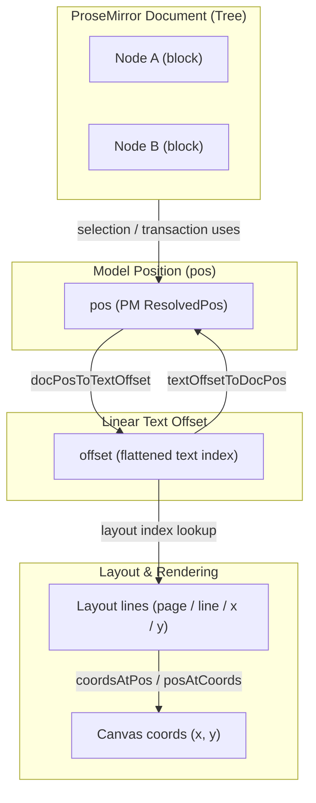

# Pos / Offset / Layout Mapping

This document describes how LumenPage maps ProseMirror `pos` (tree position),
linear text `offset`, and visual layout coordinates.

## Core Conversions
- `pos -> offset`: `docPosToTextOffset(doc, pos)`
- `offset -> pos`: `textOffsetToDocPos(doc, offset)`
- `offset -> line`: `getLineAtOffset(layoutIndex, offset)`
- `offset -> coords`: `coordsAtPos(layout, offset, scrollTop, viewportWidth, textLength)`

## Why This Matters
- **Transactions** use `pos`, not `offset`.
- **Canvas rendering** uses `offset` and layout lines.
- **Cursor / selection** must stay consistent across `pos` and `offset` or
  you'll see jumpy caret, wrong selection, or phantom deletes.

## Typical Flow
1. User input (keyboard / pointer) yields a `pos`.
2. `pos` is converted to `offset` for layout lookup.
3. Layout produces `line` and `coords`.
4. Rendering draws at `coords`, while editing commands mutate by `pos`.

